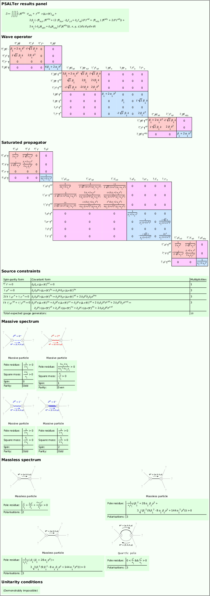

# Particle Spectrum for Any Tensor Lagrangian (_PSALTer_)
## Version 1.0.0

- Initial release to accompany pre-print and docs.
- Functionality for Weyl gauge theory and metric affine gravity removed due to ongoing collaborations with Tallinn and Tartu.

## License

Copyright © 2022 Will Barker, Stephanie Buttigieg, Carlo Marzo, Cillian Rew, Claire Rigouzzo, Zhiyuan Wei, David Yallup and Haoyang Ye

_PSALTer_ is distributed as free software under the [GNU General Public License (GPL)](https://www.gnu.org/licenses/gpl-3.0.en.html).

_PSALTer_ is provided without warranty, or the implied warranty of merchantibility or fitness for a particular purpose.

## About

_PSALTer_ is an (unofficial) part of the [_xAct_ bundle](http://www.xact.es/). 

_PSALTer_ is designed to predict the propagating quantum particle states in any tensorial field theory, including (but not limited to) just about any theory of gravity. The _free_ action $S_{\text{F}}$ must have the structure
```math
S_{\text{F}}=\int\mathrm{d}^4x\ \zeta(x)^{\text{T}}\cdot\Big[\mathcal{O}(\partial)\cdot\zeta(x)-j(x)\Big],
```
where the ingredients are:
- The dynamical fields $\zeta$ are real tensors, which may be a collection of distinct fields, each field having some collection of spacetime indices, perhaps with some symmetry among the indices. 
- The wave operator $\mathcal{O}$ is a real, second-order (Ostrogradsky's theorem discourages higher-derivative operators, but even if it did not we note that the apparent order may always be lowered by the introduction of extra fields) differential operator constructed from the flat-space metric $\eta$ and partial derivative $\partial$ (but _not_ the totally antisymmetric $\epsilon$ tensor), linearly parameterised by a collection of coupling coefficients.
- The source currents $j$ are conjugate to the fields $\zeta$. They encode all external interactions to second order in fields, whilst keeping the external dynamics completely anonymous.

For theories of this form, the _spin-projection operator_ (SPO) algorithm applies and the _PSALTer_ package may be used. Of course, spectra can also be obtained for more exotic theories, but these require the algorithm to be modified beyond its minimal form.

### Example: Melichev-Percacci theory

As a demonstration, let's say our Lagrangian is the Kretschmann curvature scalar, plus the square of the torsion tensor
```math
S_{\text{F}}=\int\mathrm{d}^4x\ \Big[\alpha_1\mathcal{R}^{\mu\nu\sigma\tau}\mathcal{R}_{\mu\nu\sigma\tau}+\beta_1\mathcal{T}^{\mu\nu\sigma}\mathcal{T}_{\mu\nu\sigma}+L_{\text{M}}\Big],
```
where $L_{\text{M}}$ is the matter Lagrangian, and $\alpha_1$ (type `Alp1`) and $\beta_1$ (type `Bet1`) are coupling coefficients. The _free_ theory is the _linearisation_ of this action near Minkowski spacetime. Taking the perturbation of the tetrad field $f_{\mu\nu}$ (type `F[-m,-n]`) to be an _asymmetric_ rank-two tensor, and the perturbation of the independent connection field $A_{\mu\nu\sigma}$ (type `A[-m,-n,-s]`) to be a rank-three tensor _antisymmetric_ in the first two indices, we can expand the theory to quadratic order, with partial derivative `CD[-m]@`. Now in a notebook, load the package:
```
<<xAct`PSALTer`;
```
and plug the quadratic expansion directly into PSALTer:
```mathematica
ParticleSpectrum[
    Alp1*A[-a,-b,-c]*CD[c]@F[a,b]+<many more terms>,
    ClassName->"PoincareGaugeTheory",
    TheoryName->"MelichevPercacciTheory",	
    Method->"Hard",
    MaxLaurentDepth->3
];
```
and execute the cell. Ten minutes later, and voilà:



To summarise the physical information that is automatically computed:
- *PSALTer results pannel:* The free action is quoted back to you.
- *Wave operator:* The wave operator is presented as a hermitian matrix in $k$-space, block-decomposed over the $J^P$ sectors of definite spin $J$ and parity $P$.
- *Saturated propagator:* The Moore-Penrose pseudoinverse of the wave operator is computed, and sandwiched between conserved source currents.
- *Source constraints:* The null spaces of the wave operator blocks encode gauge symmetries of the theory, corresponding to conservation laws satisfied by the source currents, these are quoted.
- *Massive spectrum:* There is listed the spectrum of massive states in the theory, with information about the square mass, pole residue, spin and parity of each state.
- *Massless spectrum:* There is listed the spectrum of massless propagating polarisations. Also, the spectrum of (pathological) higher-order poles is computed, up to a depth specified by `MaxLaurentDepth`.
- *Unitarity conditions:* From the requirement of positivity of the pole residues, and of the square masses, the inequality conditions on the parameters `Alp1` and `Bet1` needed to ensure unitarity of the S-matrix are computed (if the theory can be made to be unitary at all).

### General use 

#### Pre-defined physics 

_PSALTer_ pre-defines a flat, Minkowskian manifold with the following ingredients:

|Object|LaTeX|
|---|---|
|`G[-m,-n]`|$\eta_{\mu\nu}$|
|`CD[-m]@`|$\partial_{\mu}$|

#### Provided functions 

_PSALTer_ defines _two_ functions. To define a tensor field you use `DefField`, which has a very similar syntax to `DefTensor` in _xTensor_:
```mathematica
DefField[
    F_[Inds___],
    Symm_,
    PrintAs->PrintAsValue_?String,
    PrintSourceAs->PrintSourceAsValue_?String
];
```
The arguments and options are as follows:
- `F` is the symbolic name of the new field.
- `Inds` are the indices of `F`, if any.
- `Symm` is the intended index-symmetry on `Inds`. The syntax is the same as in `DefTensor`.
- `PrintAsValue` is the string that `F` will format as. The syntax is the same as in `DefTensor`.
- `PrintSourceAsValue` is the string that the source conjugate to `F` will format as.

To compute a spectrum use `ParticleSpectrum`:
```mathematica
ParticleSpectrum[
    L_,
    TheoryName->TheTheoryName_?String,
    Method->TheMethod_?String,
    MaxLaurentDepth->TheMaxLaurentDepth_
];
```
and the arguments and options are as follows:
- `L` must be a valid linearised Lagrangian density. The expression must be a Lorentz-scalar. Each term must be quadratic in the field(s) `F` defined using `DefField`. Each term must be linear in coupling constants defined using `DefConstantSymbol` from _xTensor_. Other allowed ingredients are `CD` acting on field(s) `F` and `G` used to contract indices. Do _not_ use an odd power of `epsilonG`, which will result in a parity-odd theory. Do _not_ include the term coupling the fields to their conjugate sources, this is automatically included.
- `TheTheoryName` can be any string. This is used for labelling the output files.
- `TheMethod` can be either of the strings `"Easy"` (default) or `"Hard"` (experimental, uses home-brewed implementations of the symbolic Moore-Penrose inverse and other innovations).
- `MaxLaurentDepth` can be `1`, `2` or `3`. This sets the maximum positive integer $n$ for which the $1/k^{2n}$ null pole residues are requested. The default is `1`, from which the massless spectrum can be obtained. Setting higher $n$ naturally leads to longer runtimes, but also allows potential (pathological) higher-order/non-simple propagator poles to be identified, down to the requested depth.

## Installation

### Requirements 

_PSALTer_ has the following dependencies:
- [_Linux x86_](https://www.linux.org/) (recommended distributions are [_Manjaro_](https://manjaro.org/), [_Arch_](https://archlinux.org/), [_RockyLinux 8 (RHEL8)_](https://rockylinux.org/), [_CentOS7 (RHEL7)_](https://www.centos.org/))
- [_Mathematica v 14.0.0.0_](https://www.wolfram.com/mathematica/)
- [_xAct v 1.2.0_](http://www.xact.es/) (required packages are [_xTensor_](http://www.xact.es/xCoba/index.html), [_SymManipulator_](http://www.xact.es/SymManipulator/index.html), [_xPerm_](http://www.xact.es/xPerm/index.html), [_xCore_](http://www.xact.es/xCore/index.html), [_xTras_](http://www.xact.es/xTras/index.html) and [_xCoba_](http://www.xact.es/xCoba/index.html))
- [_RectanglePacking_](https://resources.wolframcloud.com/PacletRepository/resources/JasonB/RectanglePacking/)

### Install 

1. Make sure you have satisfied all the dependencies.
2. Download _PSALTer_:
	```bash, git
	git clone https://github.com/wevbarker/PSALTer
	cd PSALTer 
	```
3. Copy the `PSALTer/xAct/PSALTer` directory into your _xAct_ installation alongside the other dependencies such as _xTensor_. For a global _xAct_ installation the following may be sufficient: 
	```bash
	cp -r ./xAct/PSALTer /usr/share/Mathematica/Applications/xAct/
	```
## Quickstart 

1. Open the example notebook at `PSALTer/xAct/PSALTer/Documentation/English/Documentation.nb`, scroll through *without running* to understand the capabilities and scope of _PSALTer_.

## Contribute

Please do! I'm always responsive to emails (about science), so be sure to reach out at [wb263@cam.ac.uk](mailto:wb263@cam.ac.uk). I will also do my best to get your code working if you are just trying to use _PSALTer_.

## Acknowledgements

This work was performed using resources provided by the Cambridge Service for Data Driven Discovery (CSD3) operated by the University of Cambridge Research Computing Service ([www.csd3.cam.ac.uk](www.csd3.cam.ac.uk)), provided by Dell EMC and Intel using Tier-2 funding from the Engineering and Physical Sciences Research Council (capital grant EP/T022159/1), and DiRAC funding from the Science and Technology Facilities Council ([www.dirac.ac.uk](www.dirac.ac.uk)).

This work was also performed using the Newton server, access to which was provisioned by Will Handley.

_PSALTer_ was improved by many useful discussions with Jaakko Annala, Stephanie Buttigieg, Mike Hobson, Manuel Hohmann, Damianos Iosifidis, Georgios Karananas, Anthony Lasenby, Yun-Cherng Lin, Carlo Marzo, Vijay Nenmeli, Roberto Percacci, Syksy Räsänen, Cillian Rew, Claire Rigouzzo, Zhiyuan Wei, David Yallup, and Sebastian Zell.

I am grateful for the kind hospitality of Leiden University and the [Lorentz Institute](https://www.lorentz.leidenuniv.nl/), and am supported by [Girton College, Cambridge](https://www.girton.cam.ac.uk/).
