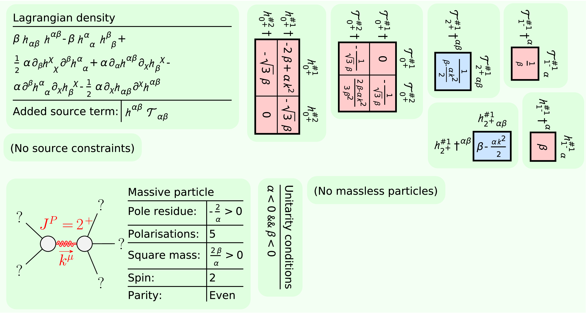

[](https://arxiv.org/abs/2311.11790)
[](https://arxiv.org/abs/2402.07641)
[](https://arxiv.org/abs/2402.14917)
[](https://arxiv.org/abs/2405.00000)


# Particle Spectrum for Any Tensor Lagrangian (_PSALTer_)
## Version 1.0.0

- Initial release to accompany pre-print and documentation.

## License

Copyright © 2022 Will Barker, Carlo Marzo and Claire Rigouzzo.

_PSALTer_ is distributed as free software under the [GNU General Public License (GPL)](https://www.gnu.org/licenses/gpl-3.0.en.html).

_PSALTer_ is provided without warranty, or the implied warranty of merchantibility or fitness for a particular purpose.

## About

_PSALTer_ is a software package for _Mathematica_ designed to predict the propagating quantum particle states in any tensorial field theory, including (but not limited to) just about any theory of gravity. The free action $S$ must have the structure
```math
S=\int\mathrm{d}^4x\ \zeta(x)^{\text{T}}\cdot\Big[\mathcal{O}(\partial)\cdot\zeta(x)-j(x)\Big],
```
where the ingredients are:
- The dynamical fields $\zeta(x)$ are real tensors, which may be a collection of distinct fields, each field having some collection of spacetime indices ($\mu$, $\nu$, etc.), perhaps with some symmetry among the indices. 
- The wave operator $\mathcal{O}(\partial)$ is a real, second-order (Ostrogradsky's theorem discourages higher-derivative operators, but even if it did not we note that the apparent order may always be lowered by the introduction of extra fields) differential operator constructed from the flat-space metric $\eta_{\mu\nu}$ and partial derivative $\partial_\mu$ (but _not_ the totally antisymmetric $\epsilon^{\mu\nu\sigma\lambda}$ tensor), linearly parameterised by a collection of coupling coefficients.
- The source currents $j(x)$ are conjugate to the fields $\zeta(x)$. They encode all external interactions to second order in fields, whilst keeping the external dynamics completely anonymous.

## Example: massive gravity 

As a demonstration, we consider the Fierz-Pauli linearised massive gravity theory
```math
S=\int\mathrm{d}^4x\ \Big[\alpha\big(-\partial^\mu h_{\mu\nu}\partial^nu h+\tfrac{1}{2}\partial_\mu h\partial^\mu h-\tfrac{1}{2}\partial_\sigma h^{\mu\nu}\partial_\sigma h_{\mu\nu}+\partial_\nu h^{\mu\nu}\partial^\sigma h_{\mu\sigma}\big)+\beta\big(h^{\mu\nu}h_{\mu\nu}-h^2\big)+h^{\mu\nu}T_{\mu\nu}\Big],
```
where $\alpha$ and $\beta$ are coupling coefficients, $h_{\mu\nu}$ is the metric perturbation and $T^{\mu\nu}$ is the linearised stress-energy tensor of matter, which is the source conjugate to $h_{\mu\nu}$.

In a fresh notebook we first load the package:
```
<<xAct`PSALTer`;
```
Next, we define Lagrangian couplings $\alpha$ and $\beta$ as `Coupling1` and `Coupling2` using the command `DefConstantSymbol` from _xAct_:
```mathematica
DefConstantSymbol[Coupling1,PrintAs->"\[Alpha]"];
DefConstantSymbol[Coupling2,PrintAs->"\[Beta]"];
```
Next, we use the command `DefField` from _PSALTer_ to define the metric perturbation $h_{\mu\nu}$ as the symmetric, rank-two tensor field `LinearMetric`:
```mathematica
DefField[
    LinearMetric[-a,-b],
    Symmetric[{-a,-b}],
    PrintAs->"\[ScriptH]",
    PrintSourceAs->"\[ScriptCapitalT]"
];
```
The output should look like:


To compute the spectrum, we plug the Lagrangian into the `ParticleSpectrum` function from _PSALTer_:
```mathematica
ParticleSpectrum[
    Coupling1*(
	(1/2)*CD[-b]@LinearMetric[a,-a]*CD[b]@LinearMetric[c,-c]
	-CD[a]@LinearMetric[-a,-b]*CD[b]@LinearMetric[c,-c]
	-(1/2)*CD[-c]@LinearMetric[a,b]*CD[c]@LinearMetric[-a,-b]
	+CD[-b]@LinearMetric[a,b]*CD[c]@LinearMetric[-a,-c]
    )+Coupling2*(
    LinearMetric[-a,-b]*LinearMetric[a,b]
    -LinearMetric[a,-a]*LinearMetric[b,-b]), 
    TheoryName->"MassiveGravity",	
    Method->"Easy",
    MaxLaurentDepth->3
];
```
The output should look like:



## Documentation 

The documentation notebook is at `PSALTer/xAct/PSALTer/Documentation/English/Documentation.nb`.

## General use 

### Pre-defined geometry

When you first run `` <<xAct`PSALTer` `` the software defines a Minkowski manifold with the ingredients:

|Wolfram Language|Output format|Meaning|
|---|---|---|
|`a`, `b`, `c`, ..., `z`|$\alpha$, $\beta$, $\gamma$, ... $\zeta$|Cartesian coordinate indices|
|`G[-m,-n]`|$\eta_{\mu\nu}$|Minkowski metric|
|`CD[-m]@`|$\partial_{\mu}$|Partial derivative|

### Provided functions 

_PSALTer_ defines _two_ functions. To define a tensor field you use `DefField`, which has a very similar syntax to `DefTensor` in _xTensor_:
```mathematica
DefField[
    FieldName_[Inds___],
    Symm_,
    PrintAs->PrintAsValue_?String,
    PrintSourceAs->PrintSourceAsValue_?String
];
```
The arguments and options are as follows:
- `FieldName` is the symbolic name of the new field.
- `Inds` are the indices of `FieldName`, if any.
- `Symm` is the intended index-symmetry on `Inds`. The syntax is the same as in `DefTensor`.
- `PrintAsValue` is the string that `FieldName` will format as. The syntax is the same as in `DefTensor`.
- `PrintSourceAsValue` is the string that the source conjugate to `FieldName` will format as.

To compute a spectrum use `ParticleSpectrum`:
```mathematica
ParticleSpectrum[
    Lagrangian_,
    TheoryName->TheoryNameValue_?String,
    Method->MethodValue_?String,
    MaxLaurentDepth->MaxLaurentDepthValue_
];
```
The arguments and options are as follows:
- `Lagrangian` must be a valid linearised Lagrangian density. The expression must be a Lorentz-scalar. Each term must be quadratic in the field(s) `FieldName` defined using `DefField`. Each term must be linear in coupling constants defined using `DefConstantSymbol` from _xTensor_. Other allowed ingredients are `CD` acting on field(s) `FieldName` and `G` used to contract indices. Do _not_ use an odd power of `epsilonG`, which will result in a parity-odd theory. Do _not_ include the term coupling the fields to their conjugate sources, this is automatically included.
- `TheoryNameValue` can be any string. This is used for labelling the output files.
- `MethodValue` can be either of the strings `"Easy"` (default) or `"Hard"` (experimental, uses home-brewed implementations of the symbolic Moore-Penrose inverse and other innovations).
- `MaxLaurentDepthValue` can be `1`, `2` or `3`. This sets the maximum positive integer $n$ for which the $1/k^{2n}$ null pole residues are requested. The default is `1`, from which the massless spectrum can be obtained. Setting higher $n$ naturally leads to longer runtimes, but also allows potential (pathological) higher-order/non-simple propagator poles to be identified, down to the requested depth.

## Quickstart 

### Requirements 

_PSALTer_ has various dependencies (version numbers reflect tested configurations).

The following dependencies are strictly required:
- [_Linux v 6.9.1_](https://www.linux.org/) (recommended distributions are [_Manjaro_](https://manjaro.org/), [_Arch_](https://archlinux.org/), [_RockyLinux 8 (RHEL8)_](https://rockylinux.org/) and [_CentOS7 (RHEL7)_](https://www.centos.org/))
- [_Mathematica v 14.0.0.0_](https://www.wolfram.com/mathematica/)
- [_xAct v 1.2.0_](http://www.xact.es/) (required packages are [_xTensor_](http://www.xact.es/xCoba/index.html), [_SymManipulator_](http://www.xact.es/SymManipulator/index.html), [_xPerm_](http://www.xact.es/xPerm/index.html), [_xCore_](http://www.xact.es/xCore/index.html), [_xTras_](http://www.xact.es/xTras/index.html) and [_xCoba_](http://www.xact.es/xCoba/index.html))

Other dependencies are only required for printing the output into publication-grade PDF figures:
- [_RectanglePacking v 1.0.0_](https://resources.wolframcloud.com/PacletRepository/resources/JasonB/RectanglePacking/)
- [_Inkscape v 1.3.2_](https://inkscape.org/)

### Installation

#### Linux and MacOS

1. Make sure your system satisfies all the dependencies.
2. Download _PSALTer_:
	```console, bash, git
	[user@system Documents]$git clone https://github.com/wevbarker/PSALTer
	[user@system Documents]$cd PSALTer 
	```
3. Copy the `PSALTer/xAct/PSALTer` directory into your _xAct_ installation alongside the other dependencies such as _xTensor_. For a global _xAct_ installation the following may be sufficient: 
	```console
	foo@bar:~$ cp -r ./xAct/PSALTer /usr/share/Mathematica/Applications/xAct/
	```

```console
foo@bar:~$ whoami
```

#### Microsoft Windows 

1. Make sure your system satisfies all the dependencies.
2. Download _PSALTer_:
	```console, cmd, git
	C:\Users\user\Documents>git clone https://github.com/wevbarker/PSALTer
	C:\Users\user\Documents>cd PSALTer 
	```
3. Copy the `PSALTer\xAct\PSALTer` directory into your _xAct_ installation alongside the other dependencies such as _xTensor_. For a global _xAct_ installation the following may be sufficient: 
	```console, cmd
	C:\Users\user\Documents\PSALTer>xcopy /e /k /h /i xAct\PSALTer "C:\Program Files\Wolfram Research\Mathematica\14.0\AddOns\Applications\xAct"
	```

## Contribute

Please do! I'm always responsive to emails (about science), so be sure to reach out at [wb263@cam.ac.uk](mailto:wb263@cam.ac.uk).

## Acknowledgements

This work used the DiRAC Data Intensive service (CSD3 [www.csd3.cam.ac.uk](www.csd3.cam.ac.uk)) at the University of Cambridge, managed by the University of Cambridge University Information Services on behalf of the STFC DiRAC HPC Facility ([www.dirac.ac.uk](www.dirac.ac.uk)). The DiRAC component of CSD3 at Cambridge was funded by BEIS, UKRI and STFC capital funding and STFC operations grants. DiRAC is part of the UKRI Digital Research Infrastructure.

This work was also performed using the Newton server, access to which was provisioned by Will Handley.

_PSALTer_ was improved by many useful discussions with Jaakko Annala, Stephanie Buttigieg, Mike Hobson, Manuel Hohmann, Damianos Iosifidis, Georgios Karananas, Anthony Lasenby, Yun-Cherng Lin, Carlo Marzo, Vijay Nenmeli, Roberto Percacci, Syksy Räsänen, Cillian Rew, Claire Rigouzzo, Zhiyuan Wei, David Yallup, and Sebastian Zell.

I am grateful for the kind hospitality of Leiden University and the [Lorentz Institute](https://www.lorentz.leidenuniv.nl/), and am supported by [Girton College, Cambridge](https://www.girton.cam.ac.uk/).
